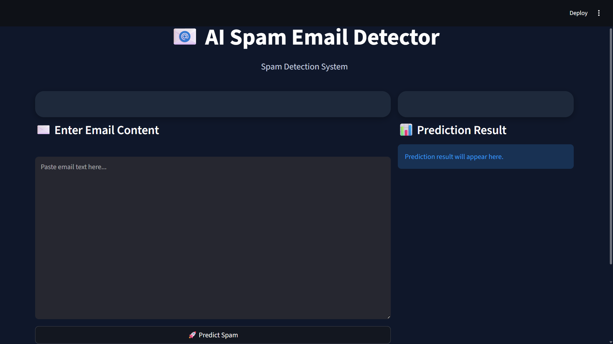
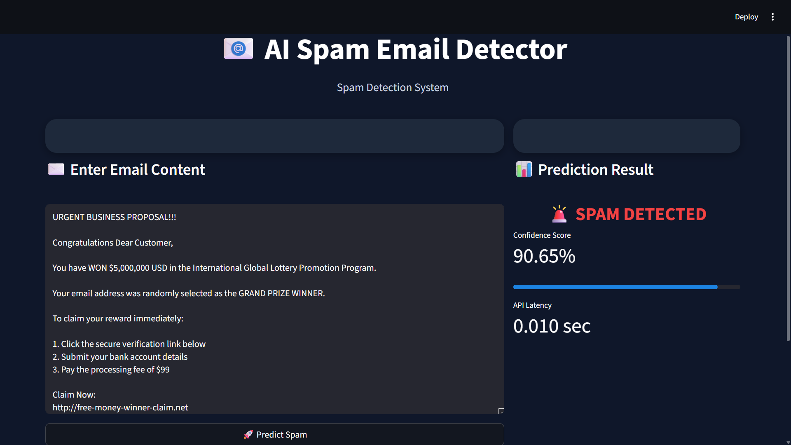

# 📧 AI Spam Email Detector

A production-style Machine Learning spam email detection system built using **Scikit-learn, FastAPI, and Streamlit**.

This project demonstrates an end-to-end ML engineering workflow including:

- Data preprocessing
- Feature engineering using TF-IDF
- Logistic Regression model training
- FastAPI inference backend
- Streamlit frontend UI
- REST API integration
- Professional project architecture

---

# 🚀 Project Demo

## 🏠 Home Screen



---

## 🚨 Spam Detection Example



---

## ✅ Safe Email Detection Example


---

# 🧠 Problem Statement

Spam emails are one of the most common cybersecurity and communication problems.

The goal of this project is to build a machine learning system capable of classifying emails as:

- Spam
- Ham (Safe Email)

using Natural Language Processing (NLP) techniques and a production-style API architecture.

---

# 🏗️ System Architecture

```text
Streamlit Frontend
        ↓
FastAPI Backend
        ↓
Inference Pipeline
        ↓
TF-IDF Vectorizer
        ↓
Logistic Regression Model
        ↓
Prediction Response
```

---

# 📂 Project Structure

```text
spam_detector/
│
├── app/
│   ├── main.py
│   ├── inference.py
│   ├── preprocessing.py
│   └── schemas.py
│
├── models/
│   ├── model.pkl
│   └── vectorizer.pkl
│
├── training/
│   └── train.py
│
├── images/
│   ├── a.png
│   ├── b.png
│   └── c.png
│
├── streamlit_app.py
├── requirements.txt
├── README.md
└── .gitignore
```

---

# ⚙️ Technologies Used

| Category | Technology |
|---|---|
| Programming Language | Python |
| Machine Learning | Scikit-learn |
| NLP | TF-IDF |
| Model | Logistic Regression |
| Backend API | FastAPI |
| Frontend UI | Streamlit |
| Model Serialization | Joblib |
| API Testing | Swagger UI |
| Version Control | Git & GitHub |

---

# 📊 Dataset Information

- Total Samples: 5796
- Duplicate Entries Removed: 467
- Classes:
  - Ham (0): 3900
  - Spam (1): 1896

---

# 🔥 Exploratory Data Analysis

Performed:
- Null value analysis
- Duplicate removal
- Email length analysis
- Word count analysis
- Class distribution analysis

### Observations

- Spam emails were generally longer
- Spam emails contained more words on average
- Dataset was moderately balanced

---

# 🧪 Machine Learning Pipeline

```text
Raw Email Text
      ↓
Text Cleaning
      ↓
Train-Test Split
      ↓
TF-IDF Vectorization
      ↓
Logistic Regression
      ↓
Prediction
```

---

# 📈 Model Performance

| Metric | Score |
|---|---|
| Accuracy | 98% |
| Spam Precision | 1.00 |
| Spam Recall | 0.95 |
| Spam F1-Score | 0.97 |

The model achieved strong precision while minimizing false positives.

---

# 🚀 FastAPI Backend

The backend provides a REST API endpoint for real-time spam prediction.

## Endpoint

```http
POST /predict
```

## Sample Request

```json
{
  "email": "Congratulations! You won free bitcoin"
}
```

## Sample Response

```json
{
  "prediction": "spam",
  "confidence": 0.98
}
```

---

# 🎨 Streamlit Frontend

The project includes a professional Streamlit UI featuring:

- Modern dark theme
- Real-time predictions
- Confidence score visualization
- API latency display
- Responsive two-panel layout

---

# ▶️ Running the Project

## 1️⃣ Clone Repository

```bash
git clone https://github.com/YOUR_USERNAME/spam-email-detector.git
```

---

## 2️⃣ Navigate to Project Folder

```bash
cd spam-email-detector
```

---

## 3️⃣ Create Virtual Environment

```bash
python -m venv venv
```

---

## 4️⃣ Activate Virtual Environment

### Windows

```bash
venv\Scripts\activate
```

### Linux / Mac

```bash
source venv/bin/activate
```

---

## 5️⃣ Install Dependencies

```bash
pip install -r requirements.txt
```

---

# 🚀 Run FastAPI Backend

```bash
uvicorn app.main:app --reload
```

Backend URL:

```text
http://127.0.0.1:8000/docs
```

---

# 🚀 Run Streamlit Frontend

Open another terminal and run:

```bash
streamlit run streamlit_app.py
```

Frontend URL:

```text
http://localhost:8501
```

---

# 🧠 Key Engineering Concepts Implemented

- Production-style project structure
- REST API development
- ML model serialization
- Real-time inference pipeline
- Input validation using Pydantic
- Frontend-backend integration
- Error handling
- Confidence scoring
- API latency measurement

---

# 🔮 Future Improvements

- Docker containerization
- CI/CD pipeline
- Cloud deployment
- Transformer-based spam detection
- Redis caching
- Authentication system
- Database integration
- Monitoring and logging
- Kubernetes deployment

---

# 📌 Learning Outcomes

This project helped in understanding:

- End-to-end ML engineering workflow
- NLP preprocessing techniques
- Feature engineering using TF-IDF
- Model evaluation metrics
- API development with FastAPI
- Frontend integration using Streamlit
- Production-oriented ML architecture

---

# 👨‍💻 Author

Abhishek

Computer Science & Engineering Student  
Aspiring AI/ML Engineer

---

# ⭐ If you found this project useful, consider starring the repository.